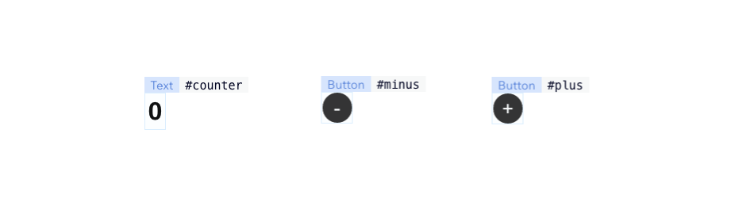

# Hello World (Counter)

Given a wix site with the following elements: Text (`#counter`), Button (`#plus`), Button (`#minus`) the code will look as follows:



```javascript
import { bind, makeAutoObservable } from "@wix/velo-bind";

const state = makeAutoObservable({
  count: 0,
});

const { counter, plus, minus } = bind($w);

counter.text = () => String(state.count);
plus.onClick(() => state.count++);
minus.onClick(() => state.count--);
```

unlike the traditional `$w` imperative syntax, every state change to `state.count` will automatically be populated back to the text element `#counter`
