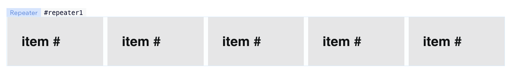

# Working with Repeaters

A [Repeater](https://www.wix.com/velo/reference/$w/repeater) is a unique Wix Editor Element which is responsible for displaying a list of elements from either a data-set (dynamic) or an array set by Velo code).
Consider a wix site with a repeater element (`#repeater`), every item in the repeater represents an item in `state.list`.



```javascript
import { makeAutoObservable, bind } from "@wix/velo-bind";

const state = makeAutoObservable({
  list: [{ value: 1 }, { value: 2 }],
});
const { repeater } = bind($w);

repeater.data = () => state.list;
repeater.item = ($item, data, index) => {
  // pass bind the $item selector to get the bound elements of a single item
  const { label } = bind($item);
  label.text = () => list[index].value;
};
```
