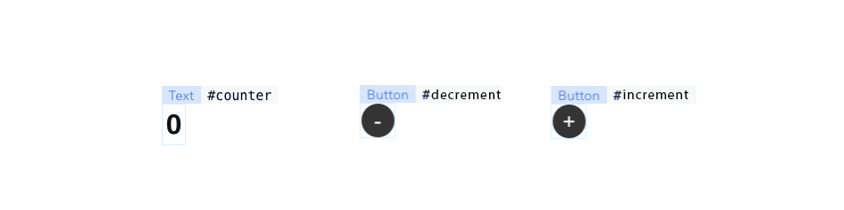

# Full Example - Counter

Given a Wix site with the following elements: Text (`#counter`), Button (`#increment`), Button (`#decrement`) the code will look as follows:



```javascript
import { bind, makeAutoObservable } from "@wix/velo-bind";

const state = makeAutoObservable({
  count: 0,
});

const { counter, increment, decrement } = bind($w);

counter.text = () => String(state.count);
increment.onClick(() => state.count++);
decrement.onClick(() => state.count--);
```

unlike the traditional `$w` imperative syntax, every state change to `state.count` will automatically populate back to the text element `#counter`.
